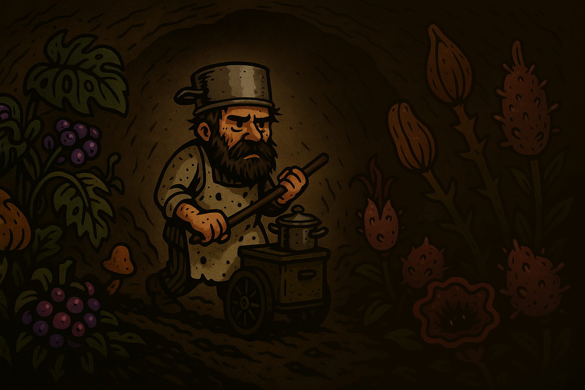

<p align="center">

<p align="center">


# Игра Chef of Dungeon
Наша игра - survival roguelike с элементами кулинарной алхимии, где вы становитесь последним шеф-поваром человечества, пытающимся выжить в подземных тоннелях после инопланетного вторжения. Проект реализован с помощью движка GODOT специально для GameJam [Вверх Или Вниз?](https://drmr.space/)




## Ограничения GameJAM
```
- [Даты GameJam] 11.09.2025 - 18.09.2025 
- [Сеттинг]      Подземелье
- [Тема]         Еда
- [Доп. тема]    Инопланетные растения
- [Команда]      Из 4-х человек
```

# Наша команда

| Участник             | Роль                                                                                                                                   | Работа                                                                                                                                  |
| ---------------- | --------------------------------------------------------------------------------------------------------------------------------------- | -----------------------------------------------------------------------------------------------------------------------------------------|
| [Ильюп Виль](https://github.com/MrStanLee1337)| Геймдизайнер|`Разработал концепцию игры, игровые механики, сюжет, нарративный дизайн и баланс. `|
| [Щурцов Федор](https://github.com/FEDOS-o)| Хардкодер (Godot)|`Реализация технической составляющей игры, также отвечал за внедрение визуального контента.`|
| [Волгушев Иван](https://github.com/VanyaVolgushev)| Хардкодер (Godot)|`Реализация технической составляющей игры, также отвечал за основные механики.`|
| Егор| Графический дизайнер |`Ответственный за визуальный контент игры.`|


# Как мы раскрыли сеттинг и обе темы GameJAM?
Тема **Еда** заставила нас задуматься. Тема проста, однако подвязать её под сеттинг подземелья и сделать нечто уникальное для GameJAM, в котором участвуют десятки команд стало занятной задачей. Почему **Подземелье**? Потому что нашу землю поработили! Мало того, атмосфера была подвержена неизвестному излучению, так что жить стало можно только под землей, а вся еда изменилась до неузнаваемости, теперь их строение и структура объединились с внеземными элементами, став **Инопланетными растениями**!

Вы - главный герой, повар, пытающийся создать рецепты в новом мире. Ваше незнание продуктов является основным препятствием игры, как создать блюда, не понимая, что они из себя представляют? Некоторые блюда насыщают, другие заставляют чувствовать голод еще сильнее, однако возможность пожарить и смешать продукты могут влиять на их атрбиут насыщения. Экспериментируйте и кормите людей, попавшихся вам на вашем пути!


## Основные продукты

<table>
  <tr>
    <td>
      
    </td>
    <td>
      
    </td>
    <td>
      
    </td>
    <td>
      
    </td>
    <td>
      
    </td>
    <td>
      
    </td>
  </tr>
</table>

Вы спросите: "Всего шесть?". Только не "всего", а "целых" шесть! Каждый продукт можно порезать и пожарить, что увеличивает количество комбинаций для создания блюд втрое, и не забывайте, что для создания блюда одного продукта недостаточно! Для двух продуктов множество сочетаний достигает пятнадцати, а для трёх уже двадцати. Сможете, будучи поваром без карты рецептов, запомнить все комбинации? Сложная задачка.


